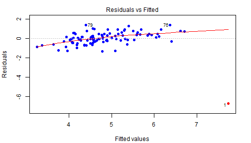

##  

<h2>Developing Data Products - Course Project</h2>
 
<h3>A Shiny application to illustrate the effect of Outliers in a dataset</h3>

--- .class #id 

## Purpose

The Shiny application *Developing Data Products* has been designed to provide an interactive way to illustrate some of the concepts in the Coursera course *Regression Models*.

It focuses on the content of the lecture on **Residuals, diagnostics, variation**, and the related information in the swirl library **Regression Models Residuals Diagnostics and Variation**.

---

## Using the application

The application is accessed at URL http://michaelwpope.shinyapps.io/DevelopingDataProducts

Two sliders allow the user to set the x and y coordinates of a new point to be added to a set of randomly-generated points with an existing dependent relationship.

---

##  

One of the plots presented by the application is a Residual plot showing the differences between the points in the dataset and the least squares line of best fit, highlighting the user-defined outlier.

 

---

## Summary

The *Developing Data Products* application provides an interactive way to see the effect of a single additional point on a set of data points, and demonstrates some of the influence measures used in data analysis and their use in the R programming language.

This simple application demonstrates the potential of the Shiny toolset to assist with illustrating underlying concepts of data analysis.

